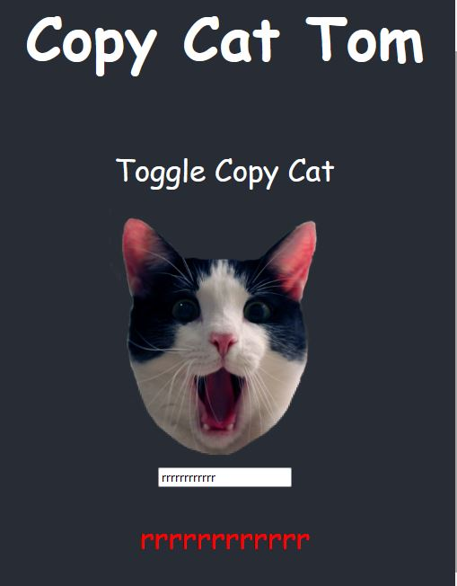

# react-copy-cat

## Copycat

In this project, I built a program that lets users type into a textbox and allows them to visualize the immediate effect that these changes have on the web page using **React**.

The program displays a textbox with a picture of a cat above it. When users type into the textbox, a copy of the text will appear below the textbox,
suggesting that the cat is being a copycat. Clicking on the image of the cat will toggle whether or not it is able to copy the user.

FIND LIVE SITE=> [React Copy Cat Site](https://realgordon.github.io/react-copy-cat/)

